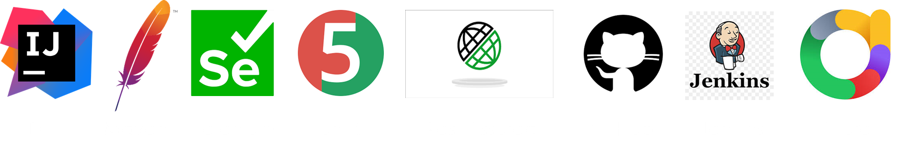
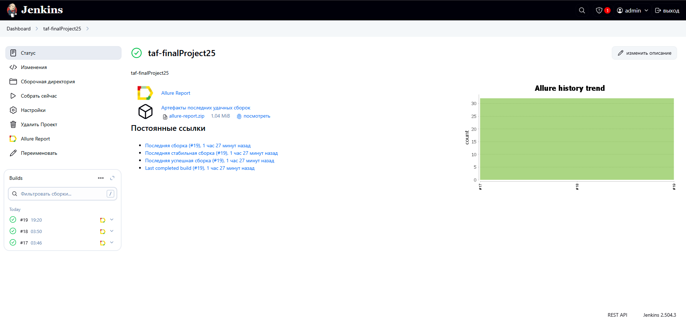
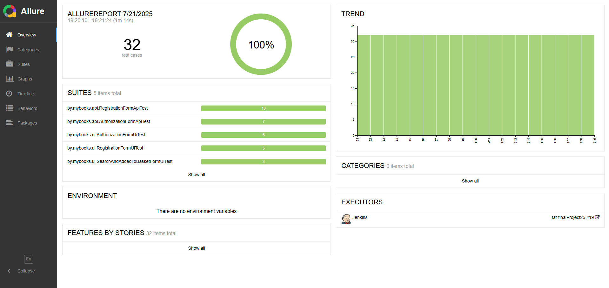

# Автоматизированный фреймворк для тестирования веб-сайта [mybooks.by](https://mybooks.by/)
**mybooks.by – книжный интернет магазин**

___

## Содержание:
- Технологии и инструменты
- Реализованные проверки
- Запуск тестов

___

## Технологии и инструменты

- Maven - для сборки проекта
- JUnit 5 - для написания и выполнения тестов
- Selenium - для автоматизации пользовательского интерфейса
- Rest-Assured - для тестирования API
- JavaFaker - дял генерации фейковых данных
- Log4j - для логирования информации о тестах
- Allure - для генерации отчетов
- Jenkins - для удаленного запуска по времени реализована job с формированием Allure-отчета

___

## Реализованные проверки

**UI тесты:**
- [x] Валидация формы Авторизации
- [x] Авторизация на сайте
- [x] Проверка цвета элементов формы Авторизация
- [x] Валидация формы Регистрация
- [x] Регистрация на сайте
- [x] Проверка цвета элементов формы Регистрация
- [x] Проверка работы кнопок
- [x] Поиск по сайту
- [x] Проверка добавления продукта в корзину

**API тесты:**
- [x] Авторизация пользователя
- [x] Регистрация пользователя

___

## Запуск тестов

**Запуск тестов вручную:**
1. Склонировать репозиторий
2. Запустить тесты: mvn test
3. Сгенерировать отчет Allure: allure serve

**Запуск тестов по времени с генерацией отчета Allure через Jenkins**
1. Создать item в Jenkins с указанием репозитория
2. В разделе "Триггеры сборки" выбрать пункт "Запускать периодически" и указать cron-расписание
3. В разделе "Шаги сборки" выбрать пункт "Вызвать цели Maven верхнего уровня". Указать цель: clean test
4. В разделе "Послесборочные операции" выбрать пункт "Allure Report". Указать путь: target/allure-results

